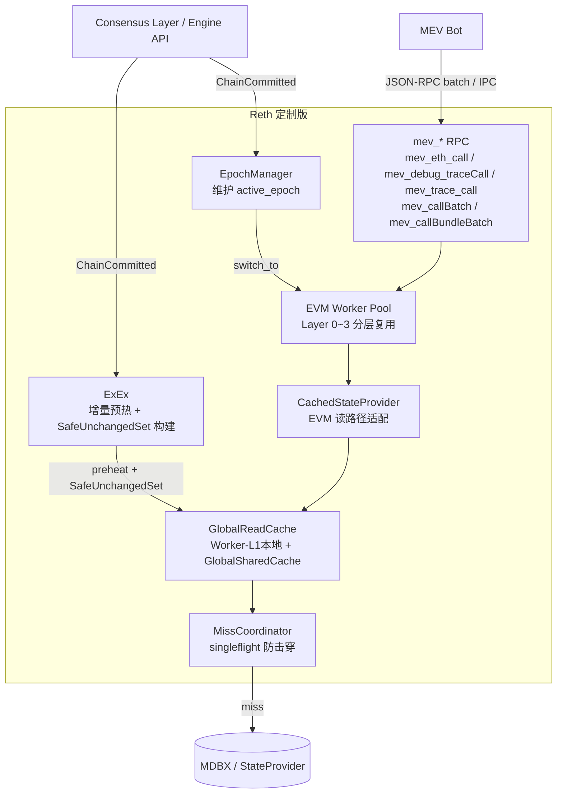
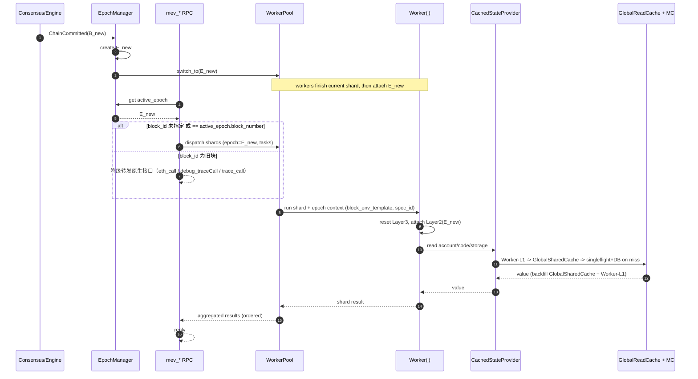
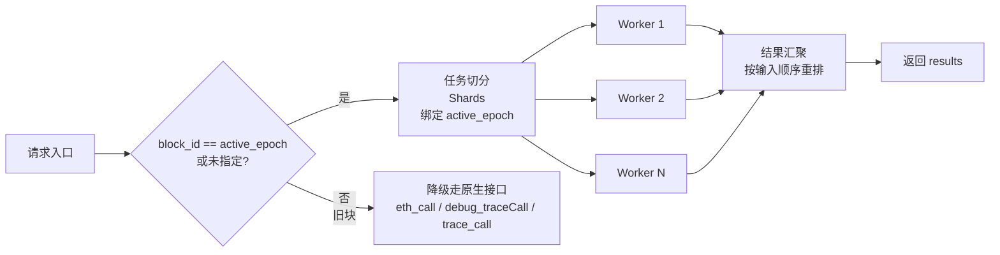

# 高性能 MEV 路径模拟架构设计（Reth 定制版）

> 版本：v3  
> 目标：单批次 1 万条路径模拟，Core 执行口径 P99 ≤ 205ms（稳态 P50 < 120ms）

---

## 1. 背景与问题

### 1.1 业务场景

MEV Bot 在每个区块内需要持续对大量交易路径（约 1 万条/批）做 EVM 模拟，以发现套利机会。
每个区块的生命周期内，会有几十批 1 万条请求持续到达。

关键前提：

- Reth 节点比 MEV Bot 先收到新块。
- 同一块内，所有模拟请求的 EVM 背景状态相同（同一 block env + 同一 state）。
- 路径之间高度重叠（集中在少数 DEX pool）。

### 1.2 原生实现的瓶颈

原生 `eth_call` 路径存在以下性能问题：

| 问题 | 原因 |
|---|---|
| 每次请求重建 EVM 执行上下文 | `State/CacheDB` 按请求创建销毁 |
| 相同 account/code/storage 重复读 DB | 请求间无共享读缓存 |
| 1 万路径需要 1 万次 RPC 调用 | 无批量接口 |
| JSON 编解码开销大 | 基于 JSON-RPC |

---

## 2. 架构意图

三个层次的优化，依次递进：

```
Layer A：复用 EVM 实例（消除重建开销）
Layer B：共享跨请求读缓存（消除重复 DB 读）
Layer C：批量 IPC 接口（消除 RPC 调用次数 + 编解码开销）
```

对应三个实施阶段：

- **Phase 1**：实现 Layer A，新增 `mev_eth_call` / `mev_debug_traceCall` / `mev_trace_call`，沿用 JSON-RPC batch 传输
- **Phase 2**：实现 Layer B，在 Phase 1 基础上叠加全局读缓存
- **Phase 3**：实现 Layer C，新增自定义 IPC 批量接口，替代 JSON-RPC batch

---

## 3. 设计原则：最小侵入 Reth

所有定制代码**独立封装在新的 `mev` crate 中**，对 Reth 原有 crate 的修改严格控制在最小必要范围。

### 3.1 独立 crate 策略

```
crates/mev/
  ├── src/
  │   ├── epoch.rs          # EpochManager
  │   ├── worker.rs         # EVM Worker Pool
  │   ├── cache.rs          # GlobalReadCache + CachedStateProvider
  │   ├── coordinator.rs    # MissCoordinator
  │   ├── api/
  │   │   ├── call.rs       # mev_eth_call
  │   │   ├── debug.rs      # mev_debug_traceCall
  │   │   └── trace.rs      # mev_trace_call / mev_trace_callBatch / mev_callBundleBatch
  │   └── lib.rs
  └── Cargo.toml
```

### 3.2 对 Reth 原有代码的修改原则

| 类别 | 允许的操作 | 禁止的操作 |
|---|---|---|
| 现有 crate | 仅增加 `pub` 访问修饰、暴露必要内部类型 | 修改已有函数逻辑 |
| `NodeBuilder` | 注册新 `mev` RPC 模块（追加，不替换） | 修改原有模块注册流程 |
| `ExEx` | 新增独立 ExEx 实例监听链事件 | 修改现有 ExEx 接口 |
| 依赖升级 | 跟随 Reth 升级被动更新 | 主动引入与 Reth 版本冲突的依赖 |

### 3.3 复用原则

- `revm` EVM 实例底层沿用 Reth 已有的 `EthEvmConfig` / `EvmFactory`，不自行 fork。
- `StateProvider` 读取接口沿用 `reth_provider` 已有 trait，通过组合而非继承扩展。
- 序列化类型（`TxRequest`、`CallResult`、`TraceResult`）沿用 `reth_rpc_types`，不重复定义。

---

## 4. 核心设计决策

在进入组件细节之前，先明确以下三条关键决策。

### 3.1 Epoch 策略：一律使用最新块

- **决策**：所有进入优化路径的请求，统一绑定当前 `active_epoch`（最新已提交区块）。
- **旧块请求**：若请求携带旧 `blockNumber`，不进入 worker pool，降级走原生 `eth_call`。
- **原因**：简化并发模型，避免复杂的多 epoch 路由；旧块降级可保证语义正确性。

### 3.2 Worker 策略：常驻复用，按 epoch 挂载会话

- **决策**：worker 不随块切换而重建，常驻；切块时原子切换 `active_epoch`，worker 完成当前 shard 后挂载新 epoch。
- **worker 内数据分四层**（见第 5 节），Layer 0/1 常驻复用，Layer 2/3 按 epoch/请求切换。
- **原因**：避免 EVM runtime 初始化开销；Layer 2 替换成本远低于重建 worker。

### 3.3 缓存策略：按 epoch 命名空间，Eager Prefetch 继承热点

- **决策**：全局读缓存 key 带 `epoch_id`；切块时通过 **Eager Prefetch** 将上一 epoch 中"可证明未变"的热点 key 主动迁移至新 epoch GlobalSharedCache，无需在读路径上做懒查父 epoch 的分支判断。
- **SafeUnchangedSet**：由 ExEx 从链上事件构建，仅纳入可严格证明未变的 key，允许不完整，宁漏不错。该能力在 **Phase 2** 引入，Phase 1 无跨 epoch 继承。
- **原因**：Eager Prefetch 使读路径保持 3 步无分支（Worker-L1 → GlobalSharedCache → DB），同时避免切块导致的首批延迟抖动。

---

## 5. 总体架构图（Phase 2 全量）



---

## 6. 核心组件

### 5.1 EpochManager

**职责**：管理区块版本，提供 `active_epoch` 查询。

- 监听 `ChainCommitted`，生成新 `EpochContext`（包含 `epoch_id`、`block_hash`、`block_number`、`block_env`、`spec_id`、`state_provider_factory`）。
- 原子更新 `active_epoch` 指针。
- 通知 WorkerPool 切换目标 epoch。
- 旧 epoch 按引用计数 + TTL 延迟回收。

**入口路由规则**：

```
请求到达
  └─ 未指定 blockNumber 或指定 == active_epoch.block_number
       └─ 进入 worker pool 优化路径
  └─ 指定旧 blockNumber
       └─ 降级走原生 eth_call（语义正确，不阻塞优化路径）
```

---

### 5.2 EVM Worker Pool

**职责**：管理常驻 EVM worker，按批次分发任务、汇聚结果。

#### worker 分层数据模型

| 层 | 名称 | 生命周期 | 内容 |
|---|---|---|---|
| Layer 0 | Worker Runtime | 进程级常驻 | EVM runtime skeleton、handler/precompile 初始化结果、scratch buffer、线程上下文 |
| Layer 1 | Worker-L1 Cache | worker 级跨请求复用 | Worker-L1 热缓存容器（按 epoch 分桶，即 GlobalReadCache Worker-L1 层的载体，常态仅保留最新桶） |
| Layer 2 | Epoch Session | 按 epoch 绑定 | `block_env_template`（coinbase / basefee / timestamp / prevrandao 等区块上下文）、`spec_id`（EVM 规格版本）|
| Layer 3 | Request Session | 请求/交易级临时 | `TxEnv`、overrides、bundle 累积态、journal/dirty/call stack/trace buffer |

#### 不同阶段的 epoch 切换行为

| 阶段 | SafeUnchangedSet | 跨 epoch 继承 | 切换时 worker 动作 |
|---|---|---|---|
| Phase 1 | ❌ 不可用 | ❌ 无继承，切块全量 miss | 更新 `block_env_template` + `spec_id`，清空 Worker-L1 旧 epoch 分桶 |
| Phase 2 | ✅ ExEx 构建 | ✅ Eager Prefetch → GlobalSharedCache | 更新 `block_env_template` + `spec_id`；GlobalReadCache 将 `SafeUnchangedSet ∩ prev.GlobalSharedCache` 批量写入新 epoch |

> Phase 1 切块后首批请求从空缓存开始，逐渐预热 Worker-L1。Phase 2 引入 GlobalSharedCache 后，切块时通过 Eager Prefetch 将上一块的热点状态迁移至新 epoch，首批延迟显著降低。

---

#### 同一 epoch 内多任务的数据复用

```
任务 A 到达（epoch = E_x）
  └─ Layer 0/1 已存在 -> 直接复用（无初始化开销）
  └─ Layer 2 已绑定 E_x -> 确认无需切换
  └─ Layer 3 新建 -> 执行 -> 完成后仅清理 Layer 3

任务 B（同属 E_x）到达
  └─ Layer 0/1/2 全部复用
  └─ Layer 3 reset + 覆写 TxEnv -> 执行
```

#### 切块行为

```
ChainCommitted(B_new)
  1. EpochManager 创建 E_new，原子切换 active_epoch
  2. 通知所有 worker：当前 shard 完成后挂载新 Layer 2（更新 block_env_template + spec_id）
  3. 新请求统一绑定 E_new

  [Phase 2 额外步骤，Phase 1 跳过]
  4. GlobalReadCache：Eager Prefetch
       for key in SafeUnchangedSet(E_new) ∩ GlobalSharedCache(E_prev):
           GlobalSharedCache(E_new).insert(key, value)  // O(N)，N 为热点集合大小
  5. 旧 epoch GlobalSharedCache 引用计数归零后释放（TTL 兜底）

  [所有阶段]
  6. 旧 epoch 晚到请求 -> 降级 eth_call（不进入 worker pool）
  7. 旧 epoch Worker-L1 分桶按 TTL 自然淘汰
```

#### 时序图（新块到达与批次执行）



---

### 5.3 GlobalReadCache（Phase 2 引入）

**职责**：跨 IPC 连接共享 account/code/storage 读缓存，消除重复 DB 读。

#### 缓存对象与 Key

| 类型 | Key |
|---|---|
| AccountInfo（nonce/balance/code_hash）| `(epoch_id, address)` |
| Bytecode | `(epoch_id, code_hash)` |
| StorageValue | `(epoch_id, address, slot)` |

> `Bytecode` 内容不可变，可在 epoch 间全局复用（以 `code_hash` 去重，不需带 `epoch_id`）。

#### 缓存分层

- **Worker-L1 Cache**：worker 本地热缓存，物理上即 Worker Layer 1 分桶（轻锁/无锁，小容量）
- **GlobalSharedCache**：全局共享缓存（分片并发 map，带容量治理，跨所有 worker 和 IPC 连接共享）

#### 读路径（CachedStateProvider）

```
EVM 请求 read(key)
  1. Worker-L1 Cache 命中
       └─ 返回

  2. GlobalSharedCache（当前 epoch，含 Eager Prefetch 迁移来的热点数据）命中
       └─ 返回，回填 Worker-L1

  3. miss
       └─ MissCoordinator singleflight(key)（合并并发 miss，防击穿）
            └─ StateProvider(DB) 读取
            └─ 回填当前 epoch GlobalSharedCache + Worker-L1
```

> **Phase 1**：无 GlobalSharedCache，也无 MissCoordinator（singleflight 保护的是共享缓存，Phase 1 不需要）。读路径退化为：Worker-L1 命中 → miss → StateProvider(DB) 直读 → 回填 Worker-L1。多 worker 并发 miss 同一 key 各自独立打 DB，底层由 MDBX buffer / OS page cache 做 IO 合并。

#### epoch 切换策略（Eager Prefetch，Phase 2 启用）

- **Phase 1**：切块全量清空 Worker-L1 旧 epoch 分桶，无跨 epoch 继承。
- **Phase 2**：切块时将 `SafeUnchangedSet ∩ prev.GlobalSharedCache` 批量写入新 epoch 的 GlobalSharedCache（Eager Prefetch），无需懒查父 epoch 的复杂分支逻辑。
- `SafeUnchangedSet` 由 ExEx 从链上事件构建，允许不完整（漏报降级打 DB，不可误报）。
- 旧 epoch GlobalSharedCache 按引用计数回收，TTL 兜底防异常驻留。

#### 其他策略

- **负缓存**：对"不存在的 account/slot/code"设置短 TTL 负缓存，防重复 miss。
- **淘汰**：按字节权重 LRU/LFU，code 权重更高。
- **MissCoordinator**：同 key 并发 miss 合并为一次 DB 请求，防击穿。

---

### 5.4 ExEx Delta Warm（Phase 2 引入）

**职责**：在新块到达时，主动预热 GlobalReadCache，缩短首批延迟。

- **触发**：监听 `ChainCommitted` / `ChainReorged`。
- **增量预热**：每新块仅预热热点 key（由 access trace / 白名单池集合 / 协议事件信号决定）。
- **SafeUnchangedSet 构建**：通过事件日志识别"未发生交易"的 DEX pool，纳入安全继承集合。
- **重组处理**：回滚受影响 epoch 的 overlay 和 SafeUnchangedSet，重建新分支热数据。

---

## 7. API 设计

所有新接口统一挂载在 `mev` 命名空间，对应原生三个接口，语义兼容，执行路径走 worker pool。

### 7.1 接口对照表

| 原生接口 | mev 新接口 | 阶段引入 | 说明 |
|---|---|---|---|
| `eth_call` | `mev_eth_call` | Phase 1 | 单笔调用，走 worker pool |
| `debug_traceCall` | `mev_debug_traceCall` | Phase 1 | 带 debug trace，走 worker pool |
| `trace_call` | `mev_trace_call` | Phase 1 | 带 parity trace，走 worker pool |
| —（无原生批量） | `mev_callBatch` | Phase 3 | 多笔独立调用，单次 IPC 处理 |
| —（无原生批量） | `mev_callBundleBatch` | Phase 3 | bundle 批量，单次 IPC 处理 |

### 7.2 Phase 1 接口（单次调用，传输层沿用 JSON-RPC batch）

**`mev_eth_call`**

```
请求：mev_eth_call(tx: TxRequest, block_id?: BlockId)
响应：CallResult
```

**`mev_debug_traceCall`**

```
请求：mev_debug_traceCall(tx: TxRequest, block_id?: BlockId, opts?: GethDebugTracingCallOptions)
响应：GethTrace
```

**`mev_trace_call`**

```
请求：mev_trace_call(tx: TxRequest, trace_types: Vec<TraceType>, block_id?: BlockId)
响应：BlockTrace
```

- 三个接口与对应原生接口语义完全兼容（入参/出参结构相同）。
- 内部执行路径替换为 worker pool；旧块请求（`block_id` 非 `active_epoch`）降级走原生接口。
- 客户端通过 JSON-RPC batch 将多个 `mev_*` 请求打包发送，无需修改传输层。

### 7.3 Phase 3 接口（自定义 IPC 批量）

**`mev_callBatch`**

```
请求：mev_callBatch(calls: Vec<TxRequest>, opts?: BatchOpts)
响应：Vec<CallResult>
```

- 每笔交易独立执行，交易间不共享 dirty 状态。
- 内部并发执行，结果按输入顺序返回。

**`mev_callBundleBatch`**

```
请求：mev_callBundleBatch(bundles: Vec<Vec<TxRequest>>, opts?: BatchOpts)
响应：Vec<Vec<CallResult>>
```

- bundle 内交易累积状态，bundle 间隔离。
- 整个 bundle 由同一 worker 顺序执行。

### 7.4 统一约束

- `mev_*` 优化路径执行版本为 `active_epoch`（未指定 `block_id` 或 `block_id == active_epoch.block_number`）。
- `block_id` 指定旧块时，请求**原样**降级走对应原生接口（`eth_call` / `debug_traceCall` / `trace_call`），由原生接口按指定 `block_id` 执行，语义正确，不进入 worker pool。
- 超出限制（最大交易数/bundle 数/返回体积）时返回明确错误码。

---

## 8. 并发执行模型



**切分策略**

- 独立交易（`mev_callBatch`）：按索引分块到多个 worker，轮转或均匀分配。
- bundle（`mev_callBundleBatch`）：整个 bundle 分给同一 worker 执行，保证 bundle 内状态累积有序。
- 同一批次所有 shard 共享同一 `epoch_id` 与 `block_env` 快照。

---

## 9. 性能指标与验收标准

### 8.1 计时口径（统一定义）

- **`T_batch_e2e`**：从 Reth 收到请求到结果可返回（含编解码）
- **`T_batch_core`**：入参解析完成后到结果内存汇总完成（纯引擎开销）

`T_batch_core` 作为引擎优化主指标，`T_batch_e2e` 作为业务端 SLO 观测指标。

### 8.2 SLO 目标（1 万路径/批）

| 场景 | P50 | P95 | P99 |
|---|---|---|---|
| 同一 block 稳态（第 3 批后） | < 120ms | < 160ms | < 205ms |
| 新 block 到达后首批 | — | < 205ms（护栏） | — |

> 以上为工程目标，须以真实链上数据 + 实际硬件压测最终收敛。

### 8.3 Core 预算分解（建议初版）

| 子项 | 预算范围 |
|---|---|
| 批量调度与排队 | 10~35ms |
| Worker-L1 / GlobalSharedCache 查询 + singleflight 等待 | 10~40ms |
| DB 读取（仅真实 miss） | 10~70ms |
| EVM 并发执行 | 35~110ms |
| 结果聚合与重排 | 5~15ms |

### 8.4 基准测试要求

- 固定硬件、固定区块、固定路径集（1e4），记录连续多批次。
- 必须区分并单独报告：同一 block 第 1/2/3 批、稳态批次、新 block 首批。
- 必须记录：`T_batch_core`、`T_batch_e2e`、Worker-L1 命中率、GlobalSharedCache 命中率、DB miss 次数、worker 利用率。
- 对比基线：原生 `eth_call` 逐笔 + JSON-RPC batch。

---

## 10. 风险与应对

| 风险 | 应对 |
|---|---|
| 缓存一致性错误 | key 强制带 `epoch_id`；仅 `SafeUnchangedSet` 允许继承；reorg 触发 overlay 回滚 |
| `SafeUnchangedSet` 误判（假阳性最危险） | 允许假阴性（少复用）；严格避免假阳性；上线后抽样 DB 对照并可自动降级规则 |
| 缓存击穿与内存膨胀 | singleflight + 按字节权重淘汰 + 负缓存 TTL + 内存用量指标报警 |
| Worker 池耗尽 | 有界任务队列 + 背压 + 快速失败（可配置） |
| 旧 epoch 请求降级后延迟上升 | 降级为原生 `eth_call` 属预期行为；客户端可通过额外的 `eth_blockNumber` 感知当前链头 |
| 切块瞬间 worker 切换抖动 | worker 完成当前 shard 后再切换，限制单 shard 粒度，避免长尾任务阻塞切换 |

---

## 11. 分阶段实施计划

### Phase 1：EVM Worker Pool + `mev_*` 单笔接口（2~3 周）

> 📄 **详细设计文档**：[Reth_simulate_optimize_phase1.md](./Reth_simulate_optimize_phase1.md)  
> 包含完整的数据结构定义、代码骨架、实现顺序、测试用例及与 Phase 2 的接口边界。

**目标**：消除每次请求重建 EVM 上下文的开销；所有新接口独立封装，不侵入 Reth 原有逻辑。

**实施内容**

- 新建 `crates/mev/` crate，注册到 `NodeBuilder` 的 RPC 模块（追加，不替换）
- 实现 `EpochManager`（监听 `ChainCommitted`，维护 `active_epoch`）
- 实现 `EVM Worker Pool`（Layer 0/1/2/3 分层，`attach_epoch` / `reset Layer3` 语义）
- 实现 `mev_eth_call` / `mev_debug_traceCall` / `mev_trace_call`（语义兼容对应原生接口）
- 旧块请求降级路由（非 `active_epoch` 请求委托给原生接口实现，不重复实现逻辑）
- 基础指标埋点（worker 利用率、`T_batch_core`、epoch 切换次数）

**验收**

- 三个 `mev_*` 接口在 JSON-RPC batch 下功能正确，结果与原生接口一致。
- 同一 block 内连续批次延迟有可观测下降（对比原生接口建立基线）。

---

### Phase 2：GlobalReadCache + ExEx 增量预热（2~4 周）

**目标**：消除同一 epoch 内的重复 DB 读，显著降低稳态 P50/P95。

**实施内容**

- 实现 `GlobalReadCache`（GlobalSharedCache，分片并发 map + 容量治理）
- 实现 `CachedStateProvider`（Worker-L1 / GlobalSharedCache 读路径，回填逻辑）
- 实现 `MissCoordinator`（singleflight 防击穿）
- 实现 `SafeUnchangedSet` 构建（事件识别 + 手动白名单池集合）
- 实现 `ExEx Delta Warm`（增量预热 + reorg 回滚）
- Worker-L1 / GlobalSharedCache 命中率、miss 次数、内存用量指标

**验收**

- L2 命中率在稳态（第 3 批后）明显提升（建议 > 70%）。
- 同一 block 稳态批次 `T_batch_core` P99 ≤ 205ms。
- 新 block 首批延迟可观测（SafeUnchangedSet 覆盖范围可配置）。

---

### Phase 3：自定义 IPC 批量接口（2~4 周）

**目标**：消除 JSON-RPC 逐笔开销，实现真正的单次调用处理整批任务。

**实施内容**

- 在 `crates/mev/` 内实现 `mev_callBatch` / `mev_callBundleBatch`（真正批量语义，内部并发执行）
- 自定义 UDS 传输协议（MessagePack 或自定义帧，旁路 JSON-RPC）
- 客户端从 JSON-RPC batch 迁移到批量接口；保留 Phase 1 的单笔 `mev_*` 接口兼容
- 对 Reth 原有代码零新增修改

**验收**

- `mev_callBatch` 单次调用 1 万路径，端到端延迟相比 Phase 2 有可测量下降。
- Phase 1/2 全部功能在新接口下行为一致。

---

## 12. 关键实现提示（Rust）

- `GlobalReadCache` 全局实例用 `Arc<GlobalReadCache>` 传递，内部用分片并发 map（如 `DashMap` 或 `moka`）。
- 所有缓存 entry 必须带 `epoch_id` 或等价版本戳，禁止无版本复用。
- `CachedStateProvider` 实现 `revm` 的 `Database` trait，封装在 `CacheDB` 之下。
- Worker 切换 epoch 时只替换 `Arc<EpochHandle>`，避免任何堆上大对象的克隆。
- 每个阶段保留 feature flag，便于灰度和快速回滚。
- 先保证正确性再优化：Phase 1 先不引入缓存层，Phase 2 再叠加缓存后做正确性回归。
