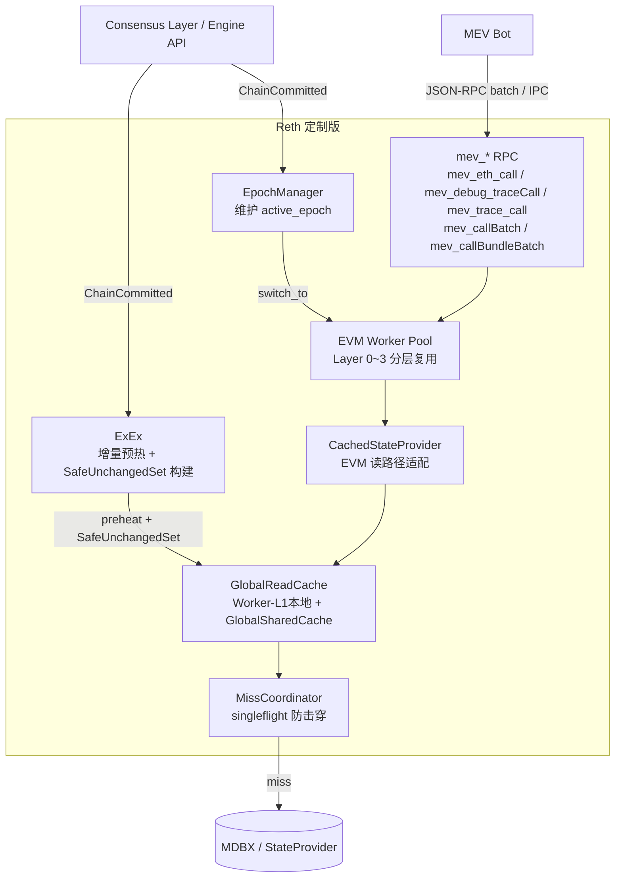
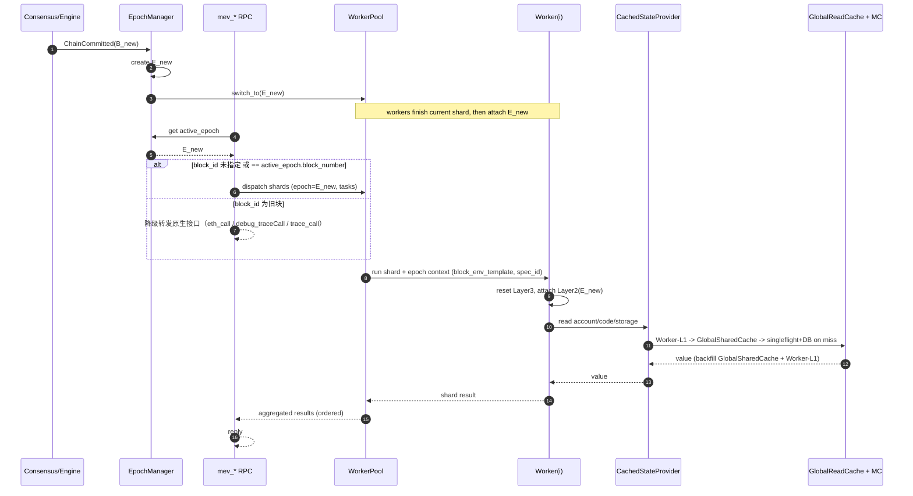
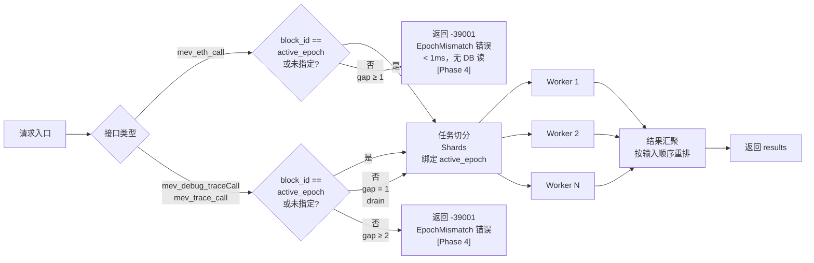

# 高性能 MEV 路径模拟架构设计（Reth 定制版）

> 版本：v3  
> 目标：单批次 1 万条路径模拟，Core 执行口径 P99 ≤ 205ms（稳态 P50 < 120ms）

---

## 1. 背景与问题

### 1.1 业务场景

MEV Bot 在每个区块内需要持续对大量交易路径（约 1 万条/批）做 EVM 模拟，以发现套利机会。
每个区块的生命周期内，会有几十批 1 万条请求持续到达。

关键前提：

- Reth 节点比 MEV Bot 先收到新块。
- 同一块内，所有模拟请求的 EVM 背景状态相同（同一 block env + 同一 state）。
- 路径之间高度重叠（集中在少数 DEX pool）。

### 1.2 原生实现的瓶颈

原生 `eth_call` 路径存在以下性能问题：

| 问题 | 原因 |
|---|---|
| 每次请求重建 EVM 执行上下文 | `State/CacheDB` 按请求创建销毁 |
| 相同 account/code/storage 重复读 DB | 请求间无共享读缓存 |
| 1 万路径需要 1 万次 RPC 调用 | 无批量接口 |
| JSON 编解码开销大 | 基于 JSON-RPC |

---

## 2. 架构意图

三个层次的优化，依次递进：

```
Layer A：复用 EVM 实例（消除重建开销）
Layer B：共享跨请求读缓存（消除重复 DB 读）
Layer C：批量 IPC 接口（消除 RPC 调用次数 + 编解码开销）
```

对应五个实施阶段：

- **Phase 1**：实现 Layer A，新增 `mev_eth_call` / `mev_debug_traceCall` / `mev_trace_call`，沿用 JSON-RPC batch 传输
- **Phase 2**：实现 Layer B，在 Phase 1 基础上叠加全局读缓存（GlobalSharedCache + CachedStateProvider + singleflight）
- **Phase 3**：精确 Diff 缓存失效，切块后命中率从 SafeUnchangedSet 覆盖率提升至近 100%，首批延迟趋近稳态
- **Phase 4**：`mev_eth_call` 过期请求快速拒绝（-39001 错误码），切断级联故障的正反馈回路
- **Phase 5**：`mev_debug_traceCall` 扩展 `withAccessList` 可选参数，零开销获取 EIP-2930 access list，供上链 tx 降低 cold slot gas 开销
- **待规划**：新增自定义 IPC 批量接口（`mev_callBatch` / `mev_callBundleBatch`），替代 JSON-RPC batch

---

## 3. 设计原则：最小侵入 Reth

所有定制代码**独立封装在新的 `mev` crate 中**，对 Reth 原有 crate 的修改严格控制在最小必要范围。

### 3.1 独立 crate 策略

```
crates/mev/
  ├── src/
  │   ├── epoch.rs          # EpochManager
  │   ├── worker.rs         # EVM Worker Pool
  │   ├── cache.rs          # GlobalReadCache + CachedStateProvider
  │   ├── coordinator.rs    # MissCoordinator
  │   ├── api/
  │   │   ├── call.rs       # mev_eth_call
  │   │   ├── debug.rs      # mev_debug_traceCall
  │   │   └── trace.rs      # mev_trace_call / mev_trace_callBatch / mev_callBundleBatch
  │   └── lib.rs
  └── Cargo.toml
```

### 3.2 对 Reth 原有代码的修改原则

| 类别 | 允许的操作 | 禁止的操作 |
|---|---|---|
| 现有 crate | 仅增加 `pub` 访问修饰、暴露必要内部类型 | 修改已有函数逻辑 |
| `NodeBuilder` | 注册新 `mev` RPC 模块（追加，不替换） | 修改原有模块注册流程 |
| `ExEx` | 新增独立 ExEx 实例监听链事件 | 修改现有 ExEx 接口 |
| 依赖升级 | 跟随 Reth 升级被动更新 | 主动引入与 Reth 版本冲突的依赖 |

### 3.3 复用原则

- `revm` EVM 实例底层沿用 Reth 已有的 `EthEvmConfig` / `EvmFactory`，不自行 fork。
- `StateProvider` 读取接口沿用 `reth_provider` 已有 trait，通过组合而非继承扩展。
- 序列化类型（`TxRequest`、`CallResult`、`TraceResult`）沿用 `reth_rpc_types`，不重复定义。

---

## 4. 核心设计决策

在进入组件细节之前，先明确以下三条关键决策。

### 3.1 Epoch 策略：一律使用最新块

- **决策**：所有进入优化路径的请求，统一绑定当前 `active_epoch`（最新已提交区块）。
- **旧块请求（Phase 1~3）**：若请求携带旧 `blockNumber`，不进入 worker pool，降级走原生接口。
- **旧块请求（Phase 4，仅 `mev_eth_call`）**：不再降级，立即返回 `-39001 EpochMismatch` 错误。trace 接口（`mev_debug_traceCall` / `mev_trace_call`）继续降级走原生接口。
- **原因**：简化并发模型，避免复杂的多 epoch 路由；`mev_eth_call` 快速拒绝可切断大流量场景下的级联故障正反馈回路。

### 3.2 Worker 策略：常驻复用，按 epoch 挂载会话

- **决策**：worker 不随块切换而重建，常驻；切块时原子切换 `active_epoch`，worker 完成当前 shard 后挂载新 epoch。
- **worker 内数据分四层**（见第 5 节），Layer 0/1 常驻复用，Layer 2/3 按 epoch/请求切换。
- **原因**：避免 EVM runtime 初始化开销；Layer 2 替换成本远低于重建 worker。

### 3.3 缓存策略：按 epoch 命名空间，Eager Prefetch 继承热点

- **决策**：全局读缓存 key 带 `epoch_id`；切块时通过 **Eager Prefetch** 将上一 epoch 中"可证明未变"的热点 key 主动迁移至新 epoch GlobalSharedCache，无需在读路径上做懒查父 epoch 的分支判断。
- **SafeUnchangedSet**：由 ExEx 从链上事件构建，仅纳入可严格证明未变的 key，允许不完整，宁漏不错。该能力在 **Phase 2** 引入，Phase 1 无跨 epoch 继承。
- **原因**：Eager Prefetch 使读路径保持 3 步无分支（Worker-L1 → GlobalSharedCache → DB），同时避免切块导致的首批延迟抖动。

> **⚡ Phase 3 关键发现**：`CanonStateNotification` 中的 `Chain` 自带 `execution_outcome().bundle_accounts_iter()`，包含该区块每个发生变更的账户及存储槽的完整 diff。利用此 diff 可做到**精确失效**：仅驱逐真正变更的条目，所有未变条目跨 epoch 直接复用——无需 `epoch_id` 作 key，也无需 ExEx SafeUnchangedSet。这彻底替代了 Eager Prefetch 方案，将切块后命中率从"SafeUnchangedSet 覆盖率"提升至近 100%（未变账户）。详见 [Phase 3 详细设计](./Reth_simulate_optimize_phase3.md)。

---

## 5. 总体架构图（Phase 2 全量）



---

## 6. 核心组件

### 5.1 EpochManager

**职责**：管理区块版本，提供 `active_epoch` 查询。

- 监听 `ChainCommitted`，生成新 `EpochContext`（包含 `epoch_id`、`block_hash`、`block_number`、`block_env`、`spec_id`、`state_provider_factory`）。
- 原子更新 `active_epoch` 指针。
- 通知 WorkerPool 切换目标 epoch。
- 旧 epoch 按引用计数 + TTL 延迟回收。

**入口路由规则（Phase 4）**：

```
请求到达
  └─ 未指定 blockNumber 或指定 == active_epoch.block_number（gap = 0）
       └─ 进入 worker pool 优化路径（所有三个接口）

  └─ mev_eth_call + gap ≥ 1
       └─ [Phase 4] 快速拒绝：返回 -39001 EpochMismatch 错误（< 1ms，无 DB 读）

  └─ mev_debug_traceCall / mev_trace_call + gap = 1（drain）
       └─ [Phase 4] 进入 worker pool，在当前 epoch N 上执行（路径模拟仍有效）

  └─ mev_debug_traceCall / mev_trace_call + gap ≥ 2（stale）
       └─ [Phase 4] 快速拒绝：返回 -39001 EpochMismatch 错误
```

---

### 5.2 EVM Worker Pool

**职责**：管理常驻 EVM worker，按批次分发任务、汇聚结果。

#### worker 分层数据模型

| 层 | 名称 | 生命周期 | 内容 |
|---|---|---|---|
| Layer 0 | Worker Runtime | 进程级常驻 | EVM runtime skeleton、handler/precompile 初始化结果、scratch buffer、线程上下文 |
| Layer 1 | Worker-L1 Cache | worker 级跨请求复用 | Worker-L1 热缓存容器（按 epoch 分桶，即 GlobalReadCache Worker-L1 层的载体，常态仅保留最新桶） |
| Layer 2 | Epoch Session | 按 epoch 绑定 | `block_env_template`（coinbase / basefee / timestamp / prevrandao 等区块上下文）、`spec_id`（EVM 规格版本）|
| Layer 3 | Request Session | 请求/交易级临时 | `TxEnv`、overrides、bundle 累积态、journal/dirty/call stack/trace buffer |

#### 不同阶段的 epoch 切换行为

| 阶段 | SafeUnchangedSet | 跨 epoch 继承 | 切换时 worker 动作 |
|---|---|---|---|
| Phase 1 | ❌ 不可用 | ❌ 无继承，切块全量 miss | 更新 `block_env_template` + `spec_id`，清空 Worker-L1 旧 epoch 分桶 |
| Phase 2 | ✅ ExEx 构建 | ✅ Eager Prefetch → GlobalSharedCache | 更新 `block_env_template` + `spec_id`；GlobalReadCache 将 `SafeUnchangedSet ∩ prev.GlobalSharedCache` 批量写入新 epoch |

> Phase 1 切块后首批请求从空缓存开始，逐渐预热 Worker-L1。Phase 2 引入 GlobalSharedCache 后，切块时通过 Eager Prefetch 将上一块的热点状态迁移至新 epoch，首批延迟显著降低。

---

#### 同一 epoch 内多任务的数据复用

```
任务 A 到达（epoch = E_x）
  └─ Layer 0/1 已存在 -> 直接复用（无初始化开销）
  └─ Layer 2 已绑定 E_x -> 确认无需切换
  └─ Layer 3 新建 -> 执行 -> 完成后仅清理 Layer 3

任务 B（同属 E_x）到达
  └─ Layer 0/1/2 全部复用
  └─ Layer 3 reset + 覆写 TxEnv -> 执行
```

#### 切块行为

```
ChainCommitted(B_new)
  1. EpochManager 创建 E_new，原子切换 active_epoch
  2. 通知所有 worker：当前 shard 完成后挂载新 Layer 2（更新 block_env_template + spec_id）
  3. 新请求统一绑定 E_new

  [Phase 2 额外步骤，Phase 1 跳过]
  4. GlobalReadCache：Eager Prefetch
       for key in SafeUnchangedSet(E_new) ∩ GlobalSharedCache(E_prev):
           GlobalSharedCache(E_new).insert(key, value)  // O(N)，N 为热点集合大小
  5. 旧 epoch GlobalSharedCache 引用计数归零后释放（TTL 兜底）

  [所有阶段]
  6. 旧 epoch 晚到请求 -> 降级 eth_call（不进入 worker pool）
  7. 旧 epoch Worker-L1 分桶按 TTL 自然淘汰
```

#### 时序图（新块到达与批次执行）



---

### 5.3 GlobalReadCache（Phase 2 引入）

**职责**：跨 IPC 连接共享 account/code/storage 读缓存，消除重复 DB 读。

#### 缓存对象与 Key

| 类型 | Phase 2 Key | Phase 3 Key（Diff 精确失效）|
|---|---|---|
| AccountInfo（nonce/balance/code_hash）| `(epoch_id, address)` | `address` |
| Bytecode | `code_hash` | `code_hash`（不变） |
| StorageValue | `(epoch_id, address, slot)` | `(address, slot)` |

> **Phase 2**：key 带 `epoch_id` 保证隔离，切块时 `invalidate_all()` 全量驱逐旧 epoch 条目，SafeUnchangedSet + Eager Prefetch 将热点迁入新 epoch。  
> **Phase 3**：移除 `epoch_id`，切块时仅 `invalidate(address)` / `invalidate((address, slot))` 驱逐 diff 涉及的条目，未变条目自动延续至新 epoch。`Bytecode` 两阶段均无 `epoch_id`（内容不可变）。

#### 缓存分层

- **Worker-L1 Cache**：worker 本地热缓存，物理上即 Worker Layer 1 分桶（轻锁/无锁，小容量）
- **GlobalSharedCache**：全局共享缓存（分片并发 map，带容量治理，跨所有 worker 和 IPC 连接共享）

#### 读路径（CachedStateProvider）

```
EVM 请求 read(key)
  1. Worker-L1 Cache 命中
       └─ 返回

  2. GlobalSharedCache（当前 epoch，含 Eager Prefetch 迁移来的热点数据）命中
       └─ 返回，回填 Worker-L1

  3. miss
       └─ MissCoordinator singleflight(key)（合并并发 miss，防击穿）
            └─ StateProvider(DB) 读取
            └─ 回填当前 epoch GlobalSharedCache + Worker-L1
```

> **Phase 1**：无 GlobalSharedCache，也无 MissCoordinator（singleflight 保护的是共享缓存，Phase 1 不需要）。读路径退化为：Worker-L1 命中 → miss → StateProvider(DB) 直读 → 回填 Worker-L1。多 worker 并发 miss 同一 key 各自独立打 DB，底层由 MDBX buffer / OS page cache 做 IO 合并。

#### epoch 切换策略（Eager Prefetch，Phase 2 启用）

- **Phase 1**：切块全量清空 Worker-L1 旧 epoch 分桶，无跨 epoch 继承。
- **Phase 2**：切块时将 `SafeUnchangedSet ∩ prev.GlobalSharedCache` 批量写入新 epoch 的 GlobalSharedCache（Eager Prefetch），无需懒查父 epoch 的复杂分支逻辑。
- `SafeUnchangedSet` 由 ExEx 从链上事件构建，允许不完整（漏报降级打 DB，不可误报）。
- 旧 epoch GlobalSharedCache 按引用计数回收，TTL 兜底防异常驻留。

#### 其他策略

- **负缓存**：对"不存在的 account/slot/code"设置短 TTL 负缓存，防重复 miss。
- **淘汰**：按字节权重 LRU/LFU，code 权重更高。
- **MissCoordinator**：同 key 并发 miss 合并为一次 DB 请求，防击穿。

---

### 5.4 ExEx Delta Warm（Phase 2 引入，Phase 3 简化）

**职责**：在新块到达时，主动预热 GlobalReadCache，缩短首批延迟。

- **触发**：监听 `ChainCommitted` / `ChainReorged`。
- **增量预热**：每新块仅预热热点 key（由 access trace / 白名单池集合 / 协议事件信号决定）。
- **SafeUnchangedSet 构建**：通过事件日志识别"未发生交易"的 DEX pool，纳入安全继承集合。
- **重组处理**：回滚受影响 epoch 的 overlay 和 SafeUnchangedSet，重建新分支热数据。

> **Phase 3 简化**：精确 Diff 失效方案使 SafeUnchangedSet 构建逻辑不再必要——链上 diff 本身已提供完整的变更集合，ExEx 可退化为纯预填充（直接将 diff 新值写入缓存），无需维护 SafeUnchangedSet。详见 [Phase 3 详细设计](./Reth_simulate_optimize_phase3.md)。

---

## 7. API 设计

所有新接口统一挂载在 `mev` 命名空间，对应原生三个接口，语义兼容，执行路径走 worker pool。

### 7.1 接口对照表

| 原生接口 | mev 新接口 | 阶段引入 | 说明 |
|---|---|---|---|
| `eth_call` | `mev_eth_call` | Phase 1 | 单笔调用，走 worker pool |
| `debug_traceCall` | `mev_debug_traceCall` | Phase 1 | 带 debug trace，走 worker pool |
| `trace_call` | `mev_trace_call` | Phase 1 | 带 parity trace，走 worker pool |
| `debug_traceCall`（扩展） | `mev_debug_traceCall` + `withAccessList` | Phase 5 | opts 新增可选字段，响应追加 `accessList`，开销 < 0.1ms |
| —（无原生批量） | `mev_callBatch` | 待规划 | 多笔独立调用，单次 IPC 处理 |
| —（无原生批量） | `mev_callBundleBatch` | 待规划 | bundle 批量，单次 IPC 处理 |

### 7.2 Phase 1 接口（单次调用，传输层沿用 JSON-RPC batch）

**`mev_eth_call`**

```
请求：mev_eth_call(tx: TxRequest, block_id?: BlockId)
响应：CallResult
```

**`mev_debug_traceCall`**

```
请求：mev_debug_traceCall(tx: TxRequest, block_id?: BlockId, opts?: GethDebugTracingCallOptions)
响应：GethTrace
```

**`mev_trace_call`**

```
请求：mev_trace_call(tx: TxRequest, trace_types: Vec<TraceType>, block_id?: BlockId)
响应：BlockTrace
```

- 三个接口与对应原生接口语义完全兼容（入参/出参结构相同）。
- 内部执行路径替换为 worker pool；旧块请求（`block_id` 非 `active_epoch`）降级走原生接口。
- 客户端通过 JSON-RPC batch 将多个 `mev_*` 请求打包发送，无需修改传输层。

### 7.3 Phase 3 接口（自定义 IPC 批量）

**`mev_callBatch`**

```
请求：mev_callBatch(calls: Vec<TxRequest>, opts?: BatchOpts)
响应：Vec<CallResult>
```

- 每笔交易独立执行，交易间不共享 dirty 状态。
- 内部并发执行，结果按输入顺序返回。

**`mev_callBundleBatch`**

```
请求：mev_callBundleBatch(bundles: Vec<Vec<TxRequest>>, opts?: BatchOpts)
响应：Vec<Vec<CallResult>>
```

- bundle 内交易累积状态，bundle 间隔离。
- 整个 bundle 由同一 worker 顺序执行。

### 7.4 统一约束

- `mev_*` 优化路径执行版本为 `active_epoch`（未指定 `block_id` 或 `block_id == active_epoch.block_number`）。
- **`mev_eth_call`**：`block_id` 指定旧块时，**[Phase 4]** 直接返回 `-39001 EpochMismatch` 错误（不降级，不做任何 DB 读取）。`data` 字段包含 `requestedBlock`、`currentEpoch`、`gap`，供 Bot 快速排空 drain 任务。
- **`mev_debug_traceCall` / `mev_trace_call`**：**[Phase 4]** gap=1（drain）时进入 worker pool 在当前 epoch N 上执行（路径模拟在最新状态上仍有效）；gap≥2（stale）时返回 `-39001 EpochMismatch` 错误。不再降级走原生接口。
- 超出限制（最大交易数/bundle 数/返回体积）时返回明确错误码。

---

## 8. 并发执行模型



**切分策略**

- 独立交易（`mev_callBatch`）：按索引分块到多个 worker，轮转或均匀分配。
- bundle（`mev_callBundleBatch`）：整个 bundle 分给同一 worker 执行，保证 bundle 内状态累积有序。
- 同一批次所有 shard 共享同一 `epoch_id` 与 `block_env` 快照。

---

## 9. 性能指标与验收标准

### 8.1 计时口径（统一定义）

- **`T_batch_e2e`**：从 Reth 收到请求到结果可返回（含编解码）
- **`T_batch_core`**：入参解析完成后到结果内存汇总完成（纯引擎开销）

`T_batch_core` 作为引擎优化主指标，`T_batch_e2e` 作为业务端 SLO 观测指标。

### 8.2 SLO 目标（1 万路径/批）

| 场景 | P50 | P95 | P99 |
|---|---|---|---|
| 同一 block 稳态（第 3 批后） | < 120ms | < 160ms | < 205ms |
| 新 block 到达后首批 | — | < 205ms（护栏） | — |

> 以上为工程目标，须以真实链上数据 + 实际硬件压测最终收敛。

### 8.3 Core 预算分解（建议初版）

| 子项 | 预算范围 |
|---|---|
| 批量调度与排队 | 10~35ms |
| Worker-L1 / GlobalSharedCache 查询 + singleflight 等待 | 10~40ms |
| DB 读取（仅真实 miss） | 10~70ms |
| EVM 并发执行 | 35~110ms |
| 结果聚合与重排 | 5~15ms |

### 8.4 基准测试要求

- 固定硬件、固定区块、固定路径集（1e4），记录连续多批次。
- 必须区分并单独报告：同一 block 第 1/2/3 批、稳态批次、新 block 首批。
- 必须记录：`T_batch_core`、`T_batch_e2e`、Worker-L1 命中率、GlobalSharedCache 命中率、DB miss 次数、worker 利用率。
- 对比基线：原生 `eth_call` 逐笔 + JSON-RPC batch。

---

## 10. 风险与应对

| 风险 | 应对 |
|---|---|
| 缓存一致性错误 | key 强制带 `epoch_id`；仅 `SafeUnchangedSet` 允许继承；reorg 触发 overlay 回滚 |
| `SafeUnchangedSet` 误判（假阳性最危险） | 允许假阴性（少复用）；严格避免假阳性；上线后抽样 DB 对照并可自动降级规则 |
| 缓存击穿与内存膨胀 | singleflight + 按字节权重淘汰 + 负缓存 TTL + 内存用量指标报警 |
| Worker 池耗尽 | 有界任务队列 + 背压 + 快速失败（可配置） |
| 旧 epoch `mev_eth_call` 请求导致级联故障 | [Phase 4] 快速拒绝（-39001），不做 DB 读取；Bot 收到错误后立即排空 drain 任务，切断正反馈回路 |
| 旧 epoch `mev_debug_traceCall` / `mev_trace_call` 降级后延迟上升 | 降级为原生接口属预期行为；trace 接口调用频率低，降级代价可接受 |
| 切块瞬间 worker 切换抖动 | worker 完成当前 shard 后再切换，限制单 shard 粒度，避免长尾任务阻塞切换 |

---

## 11. 分阶段实施计划

### Phase 1：EVM Worker Pool + `mev_*` 单笔接口（2~3 周）

> 📄 **详细设计文档**：[Reth_simulate_optimize_phase1.md](./Reth_simulate_optimize_phase1.md)  
> 包含完整的数据结构定义、代码骨架、实现顺序、测试用例及与 Phase 2 的接口边界。

**目标**：消除每次请求重建 EVM 上下文的开销；所有新接口独立封装，不侵入 Reth 原有逻辑。

**实施内容**

- 新建 `crates/mev/` crate，注册到 `NodeBuilder` 的 RPC 模块（追加，不替换）
- 实现 `EpochManager`（监听 `ChainCommitted`，维护 `active_epoch`）
- 实现 `EVM Worker Pool`（Layer 0/1/2/3 分层，`attach_epoch` / `reset Layer3` 语义）
- 实现 `mev_eth_call` / `mev_debug_traceCall` / `mev_trace_call`（语义兼容对应原生接口）
- 旧块请求降级路由（非 `active_epoch` 请求委托给原生接口实现，不重复实现逻辑）
- 基础指标埋点（worker 利用率、`T_batch_core`、epoch 切换次数）

**验收**

- 三个 `mev_*` 接口在 JSON-RPC batch 下功能正确，结果与原生接口一致。
- 同一 block 内连续批次延迟有可观测下降（对比原生接口建立基线）。

---

### Phase 2：GlobalReadCache + ExEx 增量预热（2~4 周）

**目标**：消除同一 epoch 内的重复 DB 读，显著降低稳态 P50/P95。

**实施内容**

- 实现 `GlobalReadCache`（GlobalSharedCache，分片并发 map + 容量治理）
- 实现 `CachedStateProvider`（Worker-L1 / GlobalSharedCache 读路径，回填逻辑）
- 实现 `MissCoordinator`（singleflight 防击穿）
- 实现 `SafeUnchangedSet` 构建（事件识别 + 手动白名单池集合）
- 实现 `ExEx Delta Warm`（增量预热 + reorg 回滚）
- Worker-L1 / GlobalSharedCache 命中率、miss 次数、内存用量指标

**验收**

- L2 命中率在稳态（第 3 批后）明显提升（建议 > 70%）。
- 同一 block 稳态批次 `T_batch_core` P99 ≤ 205ms。
- 新 block 首批延迟可观测（SafeUnchangedSet 覆盖范围可配置）。

---

### Phase 3：精确 Diff 缓存失效（2~3 周）

> 📄 **详细设计文档**：[Reth_simulate_optimize_phase3.md](./Reth_simulate_optimize_phase3.md)

**目标**：利用链上执行 diff 实现精确缓存失效，将切块后命中率从 SafeUnchangedSet 覆盖率提升至近 100%，切块首批延迟趋近于稳态延迟。

**实施内容**

- **Diff 精确失效**（取代 `invalidate_all()` + SafeUnchangedSet + Eager Prefetch）
  - 移除 GlobalSharedCache `accounts` / `storage` key 中的 `epoch_id`
  - `EpochManager` 接收完整 `CanonStateNotification`，调用 `on_epoch_change_diff(notification)`
  - Commit 通知：仅失效 `execution_outcome().bundle_accounts_iter()` 中的变更条目
  - Reorg 通知：`invalidate_all()` 保守处理（reorg 小概率，不必优化）
- **Diff 预填充**（Zero-DB-read epoch transition）
  - Commit 通知后，将 diff 中的**新值**直接写入 GlobalSharedCache，无需 DB 读
  - 切块后 worker 首批请求：变更账户命中 pre-fill，未变账户命中遗留缓存，DB 穿透接近零
- **指标完善**
  - 新增 `mev_epoch_warmup_duration_seconds`（diff invalidate + pre-fill 耗时）
  - `mev_epoch_manager_delay_us` 将包含此预热时间

**验收**

- 切块后首批请求 GlobalSharedCache 命中率 > 95%，DB 穿透数 ≤ diff 变更账户数（约 500 条）。
- 切块首批 `T_batch_core` P99 与稳态 P99 差距 < 20ms。
- 正确性：连续 100 个区块与原生 `eth_call` 结果完全一致。

---

### Phase 4：mev_eth_call 过期请求快速拒绝（1~2 天）

> 📄 **详细设计文档**：[Reth_simulate_optimize_phase4.md](./Reth_simulate_optimize_phase4.md)

**目标**：以快速错误（-39001 EpochMismatch）替代对过期 `mev_eth_call` 的降级处理，切断大流量场景下级联故障的正反馈回路。

**实施内容**

- `server.rs`：`mev_eth_call` gap≥1 → 返回 `-39001 EpochMismatch` 错误（含 `MEV_REJECT_STALE_CALL` 回退开关）
- `server.rs`：`mev_debug_traceCall` / `mev_trace_call` gap=1 → worker（在 N 上执行）；gap≥2 → 返回 `-39001`
- `server.rs`：新增 `epoch_mismatch_error()` 辅助函数；移除废弃的 `DebugApiServer`/`TraceApiServer` 导入
- `metrics.rs`：新增 `record_epoch_mismatch()` 函数和 `mev_epoch_mismatch_total` 指标（**全量 gap 事件**，包含拒绝与 promote）
- `epoch.rs`：补充 `active_block_number()` 方法
- 环境变量开关 `MEV_REJECT_STALE_CALL`（默认 `1`，`0` 回退 Phase 3 降级行为）
- Grafana：**将 "降级 Gap 分析" 面板替换为 "Gap 数量分布"**，使用 `mev_epoch_mismatch_total{method, reason}`

**验收**

- 所有三个接口均无降级路径（`mev_degraded_path_total` / `mev_degraded_gap_total` 为 0）
- `mev_eth_call` 过期请求响应时间 < 1ms（无 DB 读）
- trace gap=1 请求进入 worker 路径，延迟与正常请求相同
- `mev_epoch_mismatch_total{reason="stale"}` 在流量激增时不触发级联
- Bot 侧正确处理 `-39001` 错误，不重试旧 `block_id`

---

## 12. 关键实现提示（Rust）

- `GlobalReadCache` 全局实例用 `Arc<GlobalReadCache>` 传递，内部用分片并发 map（如 `DashMap` 或 `moka`）。
- **Phase 2**：所有缓存 entry 必须带 `epoch_id`，禁止无版本复用。**Phase 3**：移除 `epoch_id`，改用 diff 失效保证一致性。
- `CachedStateProvider` 实现 `revm` 的 `Database` trait，封装在 `CacheDB` 之下。
- Worker 切换 epoch 时只替换 `Arc<EpochHandle>`，避免任何堆上大对象的克隆。
- 每个阶段保留 feature flag，便于灰度和快速回滚。
- 先保证正确性再优化：Phase 1 先不引入缓存层，Phase 2 再叠加缓存后做正确性回归，Phase 3 移除 epoch_id 后必须做完整的链上重放对照测试。

---

## 13. 设计决策记录：为何不复用 Engine 的 ExecutionCache

Reth engine 模块内置了 `ExecutionCache`（基于 `fixed_cache`）和 `PayloadExecutionCache`，已包含完整的 account / storage / bytecode 缓存层，且在 pre-warming 阶段已对下一块的热点数据做了预填充。曾评估是否可以用它直接替代 MEV 的 `GlobalSharedCache`，结论是**不可行**，根本原因是并发模型冲突：

### 13.1 写覆盖导致正确性破坏（最致命）

`ExecutionCache` 底层是 `Arc<ExecutionCacheInner>`，`clone()` 只增加引用计数，不复制数据。Engine 处理 Block N+1 时，会向同一个 `Arc` 写入 pre-warm 数据和 `insert_state(bundle_N+1)` 的结果。若 MEV workers 持有该 Arc 的克隆，则在模拟 Block N 时会静默读到 Block N+1 的状态——无报错，结果错误。

```
Engine 的写入模式：单块执行窗口内顺序写，写完即交还
MEV 的读取模式：整个 epoch（12s）内 60 workers 持续并发读

两者时间重叠时，Engine 写 N+1 覆盖 MEV 正在读的 N 的数据
```

### 13.2 排他性约束与 MEV 持有时间不兼容

`PayloadExecutionCache::get_cache_for()` 要求 `is_available()`（`Arc::strong_count == 1`），即无其他持有者。MEV workers 在整个 epoch 内需要持有引用，导致 Engine 在处理下一块时拿不到缓存，自身 pre-warm 退化为冷启动——反而破坏了 Engine 自身的性能。

### 13.3 `fixed_cache` 不支持遍历，深拷贝路线被封死

`fixed_cache` 文档明确声明 `No iteration: Individual entries cannot be enumerated`，无法通过遍历做深拷贝来产生一份独立副本供 MEV 独占使用。

### 13.4 结论与正确方案

| 复用方式 | 可行性 | 原因 |
|----------|--------|------|
| `Arc::clone` 共享实例 | ❌ | 写覆盖导致正确性破坏 |
| 深拷贝独立副本 | ❌ | `fixed_cache` 无遍历 API |
| 借用时间窗口（canonical 后、N+1 pre-warm 前）| ❌ | 窗口 < 几毫秒，不可依赖 |
| **复用 `insert_state` 逻辑填充 MEV 自有缓存** | ✅ | Phase 3 `pre_fill_diff` 采用此方案 |

**正确做法**：MEV 维护自己独立的 `GlobalSharedCache`（moka，支持并发 + LRU），参照 `ExecutionCache::insert_state` 的实现逻辑（含 SELFDESTRUCT 边界处理）实现 `pre_fill_diff`，共享**设计思路**而非**内存实例**。

---

## 14. 环境变量参考

所有 MEV 模块配置均通过环境变量注入，无需修改代码或重新编译。节点启动时各变量会写入日志，便于核查。

| 变量名 | 默认值 | 作用 | 备注 |
|--------|--------|------|------|
| `MEV_WORKER_COUNT` | `40` | EVM Worker Pool 的 worker 线程数。建议设为物理核心数的 60%~80%，为 Tokio / Engine 预留余量。 | 过多会导致 CPU 竞争，过少会使任务排队延迟上升 |
| `MEV_GLOBAL_CACHE_MAX_MB` | `16384`（16 GB）| `GlobalSharedCache` 总内存上限（MB）。内部按 account 25% / storage 70% / bytecode 5% 三段分配。 | 建议不超过可用内存的 50%；按字节权重 LRU 淘汰，超限后自动驱逐 |
| `MEV_STATS_INTERVAL_SECS` | `30` | 周期性 `tracing::info` 统计日志的输出间隔（秒）。日志包含各 `mev_*` 方法的总量、增量、降级率、错误率及缓存条目数。 | 设为 `0` 无效，最小生效值为 1 |
| `MEV_DEBUG_FIXED_EPOCH` | 未设置 | **仅用于调试**：将 EpochManager 冻结在指定区块高度，所有 `mev_*` 请求始终使用该块的状态。设置后节点不再跟随链头推进。 | ⚠️ 禁止在生产环境设置；启动时会打印 `WARN` 日志警告 |
| `MEV_DIFF_CACHE` | `1`（启用） | **灰度开关**：控制 Phase 3 精确 Diff 缓存失效逻辑。`1`（或未设置）= Phase 3 启用（`on_epoch_change_diff` + `pre_fill_diff`）；`0` = 回退 Phase 2 全量失效（`invalidate_all()`）。 | 生产遇到问题时，`systemd` 加 `Environment=MEV_DIFF_CACHE=0` 重启即可回退，无需重新部署二进制 |
| `MEV_REJECT_STALE_CALL` | `1`（启用） | **灰度开关**：控制 Phase 4 三个 `mev_*` 接口的 stale 处理。`1`（或未设置）= Phase 4 启用：`mev_eth_call` 旧请求返回 `-39001`，`mev_debug_traceCall` / `mev_trace_call` 的 `gap=1` 走 worker、`gap>=2` 返回 `-39001`；`0` = 回退 Phase 3 降级行为（走原生接口）。 | Bot 侧适配完成前建议先设 `0` 灰度；确认 Bot 正确处理 `-39001` 后切 `1` |

### 典型配置示例（`systemd` service）

```ini
[Service]
Environment=MEV_WORKER_COUNT=32
Environment=MEV_GLOBAL_CACHE_MAX_MB=8192
Environment=MEV_STATS_INTERVAL_SECS=60
Environment=MEV_DIFF_CACHE=1
Environment=MEV_REJECT_STALE_CALL=1
```

### 快速回退 Phase 2（diff 缓存）

```ini
# 在 /etc/systemd/system/reth.service.d/override.conf 中追加：
[Service]
Environment=MEV_DIFF_CACHE=0
```

### 快速回退 Phase 4（eth_call 快速拒绝）

```ini
# Bot 侧适配前或遇到问题时：
[Service]
Environment=MEV_REJECT_STALE_CALL=0
```

然后 `systemctl daemon-reload && systemctl restart reth`。

---

## 附录：accessList 支持（`tryArbiBatchDirect` 阶段）

### 背景

sender 侧上链交易需要附带 `accessList`（EIP-2930），用于 pre-warm 状态访问，降低实际 gas 消耗并提高打包成功率。需求是：为 Go 侧最终选定的 `direct` 或 `dynamic` 路径，生成与实际上链 calldata 完全一致的 access list。

原生 `eth_createAccessList` 不可用，原因是：
- 不支持 `blockOverrides`（缺少 next-block 语义的 `time` / `baseFeePerGas` 覆写）；
- 多执行一遍 `transact`（将 access list 写回后二次执行以返回精确 gas used），对本场景是无意义开销。

---

### 决策一：在 `tryArbiBatchDirect` 阶段收集，不在 `mid1` 阶段收集

#### Go 侧调用链结构

```
mid1（try_arbi_batch.go）
  From: TESTER
  To:   SimulateAddress（= dynamic router 合约）
  Data: backrun EncodeData（原始，不含 approve 字节）
  目的：多路径 × 多 percent 变体批量评分，获得 gasUsed + output + ApproveArr

  ↓ 筛选出最优路径

buildDirectAndDynamic
  → 构造 DirectCallData（ProxyAddress 的 calldata）
  → 构造 DynamicCallData（注入 approve 字节后的 dynamic router calldata）

  ↓

tryArbiBatchDirect（try_arbi_batch_direct.go）
  direct:   From=EOA, To=ProxyAddress,      Data=DirectCallData
  dynamic:  From=EOA, To=SimulateAddress,   Data=DynamicCallData（含 approve）
  目的：获得 GasUsedDirect / GasUsedDynamic，此阶段 calldata 为最终上链形态
```

#### 为何不在 mid1 阶段收集

mid1 的执行上下文与最终上链 tx 存在以下差异，导致其 access list **语义不正确**：

| 差异项 | mid1 | 实际上链 tx |
|---|---|---|
| `From` | `TESTER`（模拟账户） | `EOA`（真实 sender） |
| `To`（direct 路径） | 不调用 ProxyAddress | `ProxyAddress` |
| approve 字节 | 无（仅 `ApproveArr` 检测结果） | DynamicCallData 中已注入 |
| 调用量 | N 路径 × M percent 变体（可达千次） | 仅最优候选（数条） |

**最关键的缺口**：`direct` 路径的上链 tx 目标是 `ProxyAddress`，而 mid1 从未调用过该合约，其代码、存储以及内部调用链上的所有 address/slot 完全不在 mid1 的 warm set 中。若使用 mid1 的 access list，direct 路径的上链交易将面临大量 cold access，access list 形同虚设。

**附加原因**：`dynamic` 路径在 mid1 中未注入 approve 字节（仅检测是否需要），approve 调用对应的 token `allowance` slot 在 mid1 中是"读检测"语义，而在 DynamicCallData 中是"写执行"语义；使用 mid1 的 access list 时 approve gas 估算偏差虽小，但语义不准确。

#### 为何不担心 mid1 的多次调用问题

因为 accessList 根本不在 mid1 阶段收集，mid1 的 N×M 次调用对此功能无影响。`tryArbiBatchDirect` 的调用量仅为最优候选条数（通常 < 20），是天然的正确位置。

---

### 决策二：为 `mev_debug_traceCall` 添加 `withAccessList` 可选参数

**不新增独立接口**（否定 `mev_createAccessList` 和 `mev_debug_traceCallWithAccessList` 两个独立接口方案）。

原因：

- `tryArbiBatchDirect` 本就要调用 `mev_debug_traceCall` 获取 `gasUsed`；
- 在同一次 EVM 执行中附带提取 access list，额外开销接近零（见决策三）；
- 独立接口意味着多一次 EVM 执行 + 多一次 RPC round-trip，反而更贵；
- 单接口 + opt-in 参数更简洁，向后完全兼容（默认不返回 access list）。

#### 接口变更

**请求**（`opts` map 新增可选字段，其余字段不变）：

```jsonc
{
  "tracer": "callTracer",
  "tracerConfig": { "onlyTopCall": true },
  "stateOverrides": { ... },
  "blockOverrides": { ... },
  "withAccessList": true
}
```

**响应**（在现有 GethTrace JSON 对象中追加字段，向后兼容）：

```jsonc
{
  "type": "CALL",
  "gasUsed": "0x...",
  "output": "0x...",
  "accessList": [
    {
      "address": "0x...",
      "storageKeys": ["0x...", "0x..."]
    }
  ]
}
```

> `withAccessList=false`（默认）时响应中无 `accessList` 字段，现有所有调用方无需变更。

**注意**：`gasUsed` 是单次 EVM 执行的真实值（"应用 access list 之前"的 gas），与原生 `eth_createAccessList` 二次执行后的精确值语义不同；对于 mevBot sender 使用 access list 降低 gas 的目的，此值已足够。

---

### 决策三：为何 `withAccessList=true` 的额外开销接近零

#### 核心原因：warm set 在 `transact()` 返回时已存在于 `res.state`

revm 的 `transact()` 返回 `ResultAndState`，其中 `state: EvmState`（即 `HashMap<Address, EvmAccount>`）包含本次执行**所有被触达**的账户（含只读访问，`AccountStatus::Touched`）及其存储槽（`account.storage` map 中所有被 SLOAD/SSTORE 过的 slot）。

这份数据**不是为 access list 额外计算的**——它是 EVM 为 EIP-2929 gas 计量（cold/warm 区分）在执行过程中必然维护的结构。提取 access list 只是在执行结束后遍历一次 `res.state`，时间复杂度为 O(touched_accounts + touched_slots)。

对 MEV backrun 交易的典型规模（3~5 个 DEX pool、2~5 个 token、1~3 个 router，共约 10~15 个地址、20~120 个 storage entry），Rust `HashMap` 迭代 + `Vec::push` 的实测开销在 **5~50 微秒**（< 0.1ms），远低于 EVM 执行本身（数十 ms），可视为**零额外开销**。

```
无 withAccessList：  EVM transact() → 丢弃 res.state → 返回 trace
有 withAccessList：  EVM transact() → 遍历 res.state（5~50µs）→ 返回 trace + accessList
```

#### 与其他可能方案的对比

| 方案 | 原理 | 额外开销 | 可行性 |
|---|---|---|---|
| 遍历 `res.state`（本方案） | 读取已存在的 warm set | < 0.1ms | ✅ 推荐 |
| `AccessListInspector` step() hook | 每条 opcode 触发 hook | +5%~15% EVM 时间 | ✅ 可用但更贵 |
| 复用 cache 统计 | Worker-L1 / GlobalSharedCache 命中记录 | 零 | ❌ 语义不等价，禁止 |
| 单独调用 `mev_createAccessList` | 独立 RPC + 独立 EVM 执行 | 1x EVM 执行 | ❌ 不必要 |

> **注意**：cache 统计（Worker-L1 命中 / DB miss）记录的是 provider 读路径，不等价于 EVM 实际触达的 address/slot 集合。两者在 bytecode 访问、重复访问去重、precompile 处理等方面均存在语义差异，**严禁用 cache 统计近似生成 access list**。

---

### Reth 侧实施细节

所有改动限定在 `crates/mev/` 内，**零侵入 Reth 已有 crate**（不修改 `alloy_rpc_types`、`reth-rpc` 等）。

#### 需修改的 4 个文件

**`crates/mev/src/api/types.rs`**

```rust
pub enum CallKind {
    Basic,
    DebugTrace {
        opts: Box<GethDebugTracingCallOptions>,
        with_access_list: bool,   // 新增
    },
    ParityTrace { trace_types: HashSet<TraceType> },
}
```

**`crates/mev/src/worker/mod.rs`**

```rust
pub enum WorkerOutput {
    Basic(Bytes),
    DebugTrace(GethTrace, Option<AccessList>),  // 追加 Option<AccessList>
    ParityTrace(TraceResults),
}
```

**`crates/mev/src/worker/worker.rs`** — `exec_debug_trace` 中提取 warm set

```rust
fn exec_debug_trace(
    evm_config: &EthEvmConfig,
    db: &mut WorkerStateDb<'_>,
    evm_env: super::EthEvmEnv,
    tx_env: EthTxEnv,
    opts: &GethDebugTracingCallOptions,
    with_access_list: bool,
) -> Result<WorkerOutput, WorkerError> {
    let mut inspector = DebugInspector::new(opts.tracing_options.clone())?;

    let res = evm_config
        .evm_with_env_and_inspector(&mut *db, evm_env.clone(), &mut inspector)
        .transact(tx_env.clone())?;

    let trace = inspector.get_result(None, &tx_env, &evm_env.block_env, &res, db)?;

    // res.state 包含本次执行所有被触达的账户与存储槽（EIP-2929 warm set 的载体）
    // 遍历一次即得 access list，无需额外 EVM 执行或 per-opcode hook
    let access_list = if with_access_list {
        Some(AccessList(
            res.state.iter()
                .map(|(addr, acc)| AccessListItem {
                    address: *addr,
                    storage_keys: acc.storage.keys()
                        .map(|slot| B256::from(*slot))
                        .collect(),
                })
                .collect(),
        ))
    } else {
        None
    };

    Ok(WorkerOutput::DebugTrace(trace, access_list))
}
```

**`crates/mev/src/api/server.rs`** — 解析 `withAccessList`，将 `accessList` 注入响应 JSON

```rust
async fn mev_debug_trace_call(
    &self,
    request: TransactionRequest,
    block_id: Option<BlockId>,
    opts: Option<GethDebugTracingCallOptions>,
) -> RpcResult<serde_json::Value> {

    // 从 opts 的 additional_fields 中读取 withAccessList（不修改 GethDebugTracingCallOptions）
    let with_access_list = opts
        .as_ref()
        .and_then(|o| o.additional_fields.get("withAccessList"))
        .and_then(|v| v.as_bool())
        .unwrap_or(false);

    // ... 现有 epoch 检查、worker dispatch 逻辑不变 ...

    let WorkerOutput::DebugTrace(trace, opt_al) = output else { /* ... */ };

    // 将 GethTrace 序列化后注入 accessList 字段（withAccessList=false 时无此字段）
    let mut json = serde_json::to_value(&trace)
        .map_err(|e| internal_rpc_err(e.to_string()))?;
    if let (Some(al), serde_json::Value::Object(ref mut map)) = (opt_al, &mut json) {
        map.insert("accessList".to_string(), serde_json::to_value(al)
            .map_err(|e| internal_rpc_err(e.to_string()))?);
    }
    Ok(json)
}
```

> `GethDebugTracingCallOptions.additional_fields` 是 alloy 预留的扩展字段 map（`IndexMap<String, Value>`），用于透传自定义字段，无需修改 alloy 类型定义。

**为何返回类型由 `GethTrace` 改为 `serde_json::Value`**：`GethTrace` 是枚举，不同 tracer 序列化结构各异，无法通过 `#[serde(flatten)]` 向其注入额外字段。改为 `serde_json::Value` 后，先完成 `GethTrace` 的正常序列化，再在 map 层插入 `accessList` key，保持原有结构完全不变，仅追加字段——对所有现有调用方完全透明。

---

### Go 侧改动

仅在已有的 `DebugTraceCallResult` 结构体中追加一个字段：

```go
type DebugTraceCallResult struct {
    GasUsed    string        `json:"gasUsed"`
    Output     string        `json:"output"`
    Error      string        `json:"error,omitempty"`
    AccessList []AccessTuple `json:"accessList,omitempty"`  // 新增
}

type AccessTuple struct {
    Address     string   `json:"address"`
    StorageKeys []string `json:"storageKeys"`
}
```

`tryArbiBatchDirect` 调用时在 opts 中加 `"withAccessList": true`；解析响应后读取 `AccessList` 字段，按选定路径（direct 或 dynamic）取对应执行的 access list 附加到上链 tx。

`mid1` 调用不传 `withAccessList`，响应中无 `accessList` 字段，Go 侧反序列化时 `omitempty` 直接忽略，**零影响**。

---

### 工程约束

- **不新增 RPC 接口**：`mev_createAccessList` 和 `mev_debug_traceCallWithAccessList` 均不实施；
- **不修改 Reth 已有代码**：所有改动限定在 `crates/mev/` 的 4 个文件内；
- **不使用 cache 统计近似 access list**：语义不等价，禁止；
- **向后兼容**：`withAccessList` 默认 `false`，所有现有调用方无需变更；
- **正确性来源于执行上下文**：access list 取自 `tryArbiBatchDirect` 的 EOA sender + 最终 calldata 执行，与实际上链 tx 完全一致。
